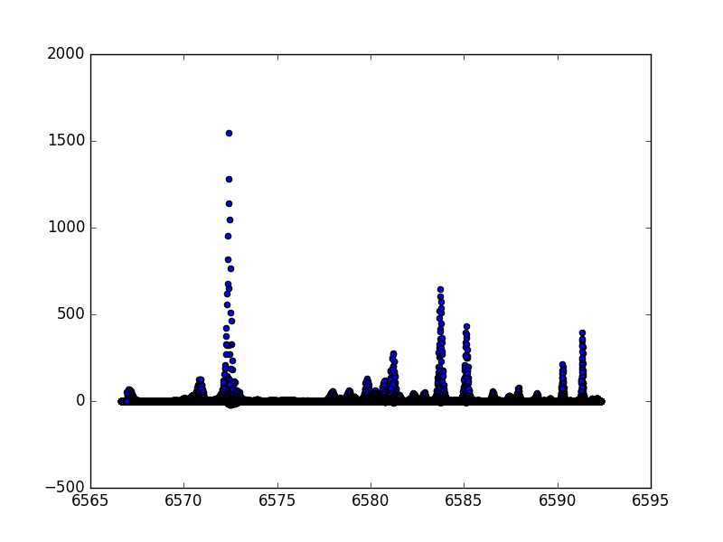
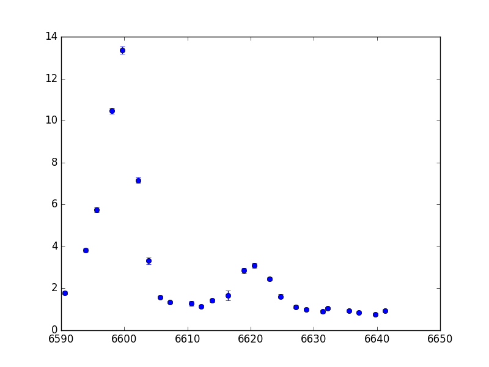

Image File Structure
====================

FITS Images
-----------

The image files created by this code are multi-extension FITS images, which have a few headers and data arrays in each file.
If you are interacting with these files using IRAF or the Astropy/Pyfits packages, you'll need to know which extensions are which.

	* Extension 0: This extension has no data array. It's header is the primary header of the file and is where all of the important keywords are stored.
	* Extension 1: This extension contains the primary data array, i.e. your image.
	* Extension 2: This extension contains the variance array. Each pixel in this array corresponds to the variance of a pixel in your image.
	* Extension 3: This extension contains the bad pixel mask array. Each pixel is either 0 or 1. Pixels with values of 1 are bad.
	* Extension 4: If this extension exists, it contains a wavelength array. Each pixel corresponds to the wavelength of a pixel in your image array.

Here's a list of some important header keywords created by *saltfppipe* that you might want to know about:

	* FPAXCEN / FPAYCEN / FPARAD -- The center and radius of the circular aperture mask.
	* FPFWHM -- The average full-width half-max of stars in the image.
	* FPXCEN / FPYCEN -- The location of the ghost reflection center / optical axis of the etalon.
	* FPWAVE0 / FPCALF -- The fitted wavelength solution parameters.

The FPImage Class
-----------------

This software also includes a class, ``FPImage``, for interacting with the images created by *saltfppipe*.
The class is largely a wrapper around a number of astropy / numpy methods.

To load an image file::

	>>> from saltfppipe.fp_image_class import FPImage
	>>> im = FPImage('mfxgbpP201111010208.fits', update=True)
	
This loads the image file ``mfxgbpP201111010208.fits`` into the variable ``im``.
The ``update=True`` argument will make it so that when I close the image, any changes I've made will be saved.
The data arrays are located in the class attributes ``inty``, ``vari``, ``badp``, and ``wave``.
These are the pixel intensity, variance, bad pixel mask, and wavelengths, respectively.

.. note:: The wavelength array extension is created at a relatively late stage of the pipeline. If it does not exist, ``im.wave`` will be ``None``.

For an example of how you can interact with these arrays, let's say I wanted to set the intensity values in my image to 0 wherever there are bad pixels::

	>>> im.inty[im.badp == 1] = 0

The ``im.writeto(filename, clobber=False)`` method will write the image to a file specified by filename.
Unless ``clobber`` is set to True, it will not overwrite an existing file.
	
There are some useful class methods for getting arrays which are the same *shape* as your image and contain pixel coordinates.

	>>> xarray, yarray = im.xyarrays()
	>>> rarray = im.rarray(798, 510)
	
The first of these methods returns two arrays.
``xarray`` contains the X coordinate of every pixel in the image.
``yarray`` does the same for the Y coordinates.

The second method, ``rarray``, returns the *radius* of every pixel in the image from the point which you specify in the calling arguments.
In this case, ``rarray`` contains the radius of every pixel from the point (798, 510).

You can get at several of the important header keywords using class attributes:

	* ``im.axcen`` -- The X coordinate of the aperture center
	* ``im.arad`` -- The radius of the circular aperture
	* ``im.ycen`` -- The Y coordinate of the ghost reflection center
	* ``im.object`` -- The name of the object which was observed
	* ``im.fwhm`` -- The average FWHM of the stars in the image

As an example of how to put all of this together, let's create a plot of pixel intensity vs. wavelength for the pixels in my opened image.
Furthermore, let's exclude any pixels which are outside the circular aperture as well as any pixels with values of '1' in the bad pixel mask::

	>>> # Some useful imports
	>>> import numpy as np
	>>> import matplotlib.pyplot as plt
	
	>>> # Get the radius from the aperture center at every pixel
	>>> rarray = im.rarray(im.axcen, im.aycen)
	
	>>> # Create a boolean array which is True for pixels
	>>> # inside the aperture and False outside it
	>>> goodpix = rarray < im.arad
	
	>>> # Combine this boolean array with the bad pixel mask
	>>> goodpix = np.logical_and(goodpix, im.badp != 1)

	>>> # Plot the intensity and wavelength of pixels wherever
	>>> # 'goodpix' is True
	>>> plt.scatter(im.wave[goodpix], im.inty[goodpix])
	>>> plt.show()

In this plot we can see a number of local peaks, which likely correspond either to galactic H-alpha and [NII] emission or to night sky emission lines.

By calling the image's ``im.close()`` method, we can close the image and save any changes we made to it.

As another example, let's say I want to look at the spectrum of my data cube at a the pixel ()::

	>>> # Some useful imports
	>>> from saltfppipe.fp_image_class import FPImage
	>>> import matplotlib.pyplot as plt
	>>> from os import listdir
	>>> import numpy as np
	
	>>> # Get a list of files in the data cube directory
	>>> cd NGC2280_cube
	>>> fnlist = sorted(listdir('.'))
	
	>>> # Open all of these files as FPImage objects
	>>> images = [FPImage(fn) for fn in fnlist]
	
	>>> # Choose the pixel we want to look at
	>>> x, y = 780, 627
	
	>>> # Get the spectrum at that point (if the pixels aren't bad!)
	>>> badps = np.array([im.badp[y, x] for im in images])
	>>> intys = np.array([im.inty[y, x] for im in images])[badps != 1]
	>>> varis = np.array([im.vari[y, x] for im in images])[badps != 1]
	>>> waves = np.array([im.wave[y, x] for im in images])[badps != 1]
	
	>>> # Plot the spectrum
	>>> plt.errorbar(waves, intys, yerr=np.sqrt(varis), fmt='o')
	>>> plt.show()
	
	>>> # Closing images is good practice!
	>>> for im in images: im.close()
	

