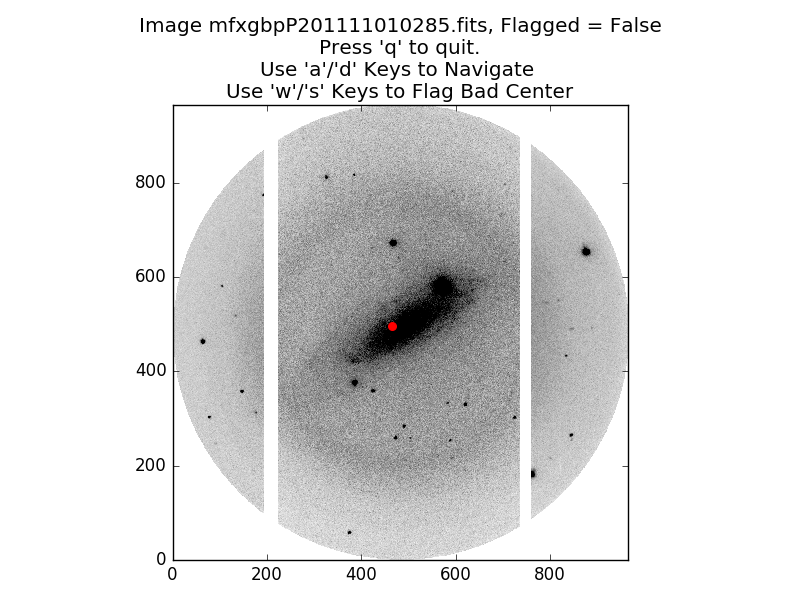

Useful Functions
================

find_ghost_centers
------------------

In sparse star fields, the default ghost center finding routine occasionally fails.
When this happens, you can use the function 'find_ghost_centers' to try to find the center using different input parameters.

In this image of NGC 1325, the default routine has failed to find the reflection center for the ghosts.
After manually examining some of my images in SAOImage DS9, I'm pretty sure the center is somewhere around pixel coordinate [793, 503].
We can force it to find this center using the 'find_ghost_centers' routine.
This is best done interactively from the python or ipython terminal::

	>>> # The images we want are in the product directory:
	>>> cd product/
	
	>>> # A few useful imports:
	>>> from os import listdir
	>>> from saltfppipe.find_ghost_centers import find_ghost_centers
	
	>>> # I happen to know that the first 3 images and last 1 image
	>>> # of my 'product/' directory are ARC images and not images
	>>> # of NGC 1325, so I don't include them in 'fnlist':
	>>> fnlist = sorted(listdir('.'))[3:-1]
	
	>>> # Now we call the 'find_ghost_centers' function:
	>>> find_ghost_centers(fnlist, tolerance=7,
	>>>                    thresh=3, guess=[792, 502])

Here we see that the 'find_ghost_centers' function successfully found several star/ghost pairs and located the center.

The calling keywords are:

	* ``fnlist`` -- A list of strings.
	  Each string should be the path to an image file in which you want to detect the ghost center.
	* ``tolerance`` -- How distant two pixels can be from each other to be considered "close enough", in units of image pixels.
	  Higher values mean the code is more likely to find a center.
	  Extremely high values will likely match objects which aren't truly star/ghost pairs.
	  Default value is 3.
	* ``thresh`` -- The minimum brightness required for an object to be detected, in units of the standard deviation of the sky background.
	  Lower values will detect more objects, increasing the likelihood of finding pairs.
	  Values which are too low will detect spurious objects.
	  Default value is 4.
	* ``guess`` -- If you think you know the center, use this keyword.
	  Must be an array-like object of length 2 containing the X and Y coordinates of your guess.
	  The true center must be within ``tolerance`` pixels of your guess for this to work.
	  No default value.

.. note:: If you're locating pixels in SAOImage DS9, subtract 1 from both coordinates before using it in Python. Python indices begin at zero, while DS9 indices begin at 1.

.. note:: If you've got a dense star field, this function can take a while to run. Increasing the value of ``thresh`` or decreasing the value of ``tolerance`` will speed up the routine. For dense star fields, this should still result in a good fit while taking much less time to run.

flatten
-------

The 'flatten' function is what's used by the pipeline to flatten your images, but it can also be used outside of the pipeline for a bit more control.
It takes two calling arguments:

	* ``fnlist`` -- A list of strings. Each string should be the relative path to an image file you want to flatten.
	* ``flatfile`` -- A string. The relative path to a flatfield image.
	
Let's say you want to flatten each data image by a different flatfield image. You can accomplish this by::

	>>> # Get your lists of data images and flatfield images somehow:
	>>> data_files = dummy_way_to_get_image_list('data')
	>>> flat_files = dummy_way_to_get_image_list('flat')
	>>> # Note that these are not real functions. I don't
	>>> # know where or how your flatfield images are stored.
	
	>>> # Import the flatten function:
	>>> from saltfppipe.flatten import flatten
	
	>>> # Call the flatten routine separately for each data
	>>> # image and its corresponding flatfield:
	>>> for data_file, flat_file in zip(data_files, flat_files):
	>>> 	flatten([data_file], flat_file)
	
.. note:: Take care with the square brackets ``[...]`` around ``data_file`` in this function call. The 'flatten' routine expects a list of image file names, so we must give it a list of length 1 for this to work properly.

align_norm
----------

The 'align_norm' function is what the pipeline uses to align and normalize your images to one another, but it can also be used outside of the pipeline if you need a bit more control.
It has a few calling arguments:

	* ``fnlist`` -- A list of strings, Each string should be the relative path to an image file in your SALT FP observation.
	* ``tolerance`` -- How distant two pixels can be from each other to be considered "close enough", in units of image pixels.
	  Higher values mean the code is more likely to match stars to each other if the image alignment drifted a lot over the course of an observation.
	  Default value is 5 pixels.
	* ``thresh`` -- The minimum brightness required for an object to be detected, in units of the standard deviation of the sky background.
	  Lower values will detect more objects, increasing the likelihood of identifying dim stars in all images.
	  Values which are too low will likely detect spurious objects.
	  Default value is 3.5.
	  
The way I recommend manually calling this function depends on the problems you're encountering with the pipeline's default version of this routine:

	* Too many stars (some of them spurious) are being detected: I recommend increasing the value of ``thresh``.
	* Very few (but nonzero) stars are being detected: I recommend decreasing the value of ``thresh``.
	* No stars are being detected: I recommend a combination of decreasing ``thresh`` and increasing ``tolerance``.
	
As an example, the default version of this routine identifies far too many stars (several of them spurious) when applied to the RINGS observations of NGC 2280.
To manually call this function on those data, I'd do the following::
	
	>>> # Useful imports:
	>>> from os import listdir
	>>> from saltfppipe.align_norm import align_norm
	
	>>> # Change to the object's directory and get a list of the images:
	>>> cd NGC2280/
	>>> fnlist = sorted(listdir('.'))
	
	>>> # Call the align_norm function with an increased thresh value:
	>>> align_norm(fnlist, thresh=5)
	
This results in far fewer stars being identified by the routine and the detections which are made being more robust.

