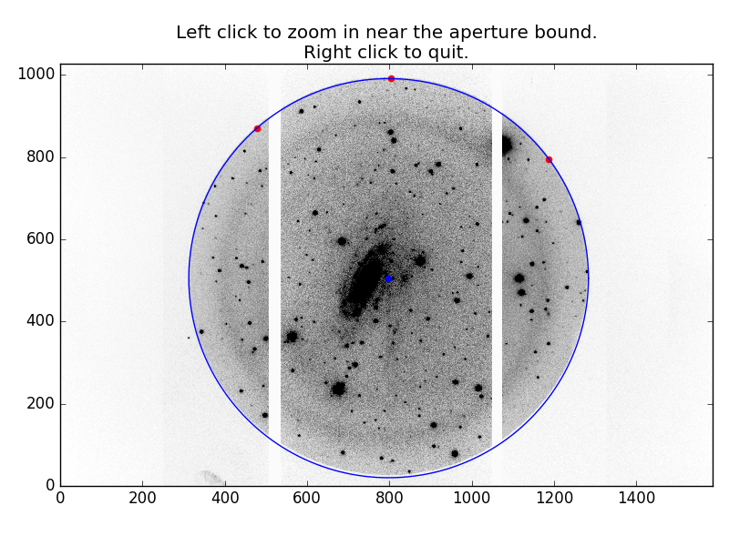
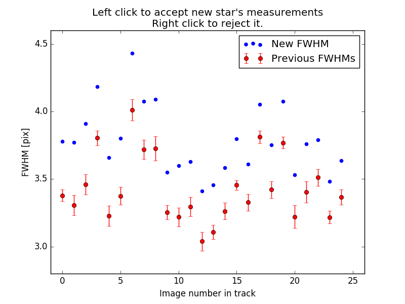

Using the Pipeline
==================

Starting Up
-----------

The *saltfppipe* pipeline is designed to be run in the directory above a 'raw/' directory filled with images from the telescope.

You can call it from an interactive environment like python or ipython with::

	>>> from saltfppipe import pipeline
	>>> pipeline()

Or you can call it directly from the command line with::
	
	$ python relative/path/to/saltfppipe/pipeline.py
	
You can also run the pipeline from another location in the directory structure (other than one directory above the 'raw/' image directory::
	
	>>> from saltfppipe import pipeline
	>>> pipeline('relative/path/to/raw/')

Or again from the command line with the path to the raw directory as a calling argument::
	
	$ python relative/path/to/saltfppipe/pipeline.py path/to/raw/)

Creating the 'product/' directory
---------------------------------

The first step of *saltfppipe* is to convert the raw images in 'raw/' to pre-processed images in a 'product/' directory.

If you already have a 'product/' directory, you'll be greeted with the prompt::

	Product directory already exists. Recreate it? (y/n)
	
If you downloaded the 'product/' directory directly from the SALT servers, you should answer **YES** to this question.
The *saltfppipe* and *zSALT* packages create the product directory in a different way than the default SALT pre-processing.

If you have already created a 'product/' directory using *saltfppipe* and don't want to start over, you can answer **NO** to this question.

This step in the reduction process creates a correctly aligned mosaic of SALT RSS's 6 CCD chips, performs crosstalk/gain/bias corrections, and does cosmic ray masking/removal.
It also creates additional image extensions in each image file for keeping track of the noise and bad pixel masks.

.. note::
	I've noticed that occasionally the *zSALT* package gets stuck and hangs forever on my machine during the cosmic ray removal process.
	If you're encountering this problem, locate ``zsalt/imred.py`` and disable multithreading by changing line 103 to read ``multithread=False``.

Image Verification
------------------

Next, the pipeline will display each image in your 'product/' directory and ask you to verify that the image and its header are correct.
This step is not strictly required, but I highly recommend it.
Relatively often, acquisition images of your object may be incorrectly marked as 'ARC' images in their headers.
Or images of Neon/Argon calibration lamps will be marked as 'FLAT' in the headers.

When in the interactive plotting environment, use the 'W' key to flag an image as bad, or the 'S' key to unflag an image.
Use the 'D' and 'A' keys to navigate forward and backward between images.

This image is an acquisition image, but is marked as 'NGC 2280' in its image headers.
I don't want to use this image, so I've used the 'W' key to flag it as bad. Note the 'Flagged=True' in the plot title.

This image of NGC 2280 is good and its header information appears correct.
Because it's good, I haven't flagged it.

Once the flagging process is completed, any flagged images reappear for a review process.

.. image:: figs/verify/review.png

Here's the acquisition image again. I don't want to use this image, so I press 'D' to delete it.
If its header information had been incorrect, I could have pressed 'H' to input new header information.
If I had flagged it by mistake, I could have pressed 'A' to approve the image.

.. note::
	Pressing 'D' doesn't actually delete files. Rather, it changes a keyword in their headers called 'FPGOOD' to False.
	If you mistakenly 'delete' an image during this process, you can manually edit this header keyword back to True to undo your mistake.
	
Aperture Masking
----------------

SALT FP images are taken with a circular aperture mask in place.
This next step in the pipeline adds pixels outside this circular aperture to the bad pixel mask.
To create the circular aperture, mark a few points near the aperture boundary by clicking on them with the mouse.

Here is one of my images of NGC 2280 before I've marked any points along the boundary.
I decide to left click on a point near the bottom right of the image to zoom in on that region.

.. image:: figs/aperture/zoom.png

Here's a zoomed-in view of the area near where I clicked.
I can left click again to mark a point on the boundary, or I can right click to zoom back out.

Now that I've marked three points along the boundary, the code tries to fit a circle to those points.
Note that at the bottom of the image, the fitted circle does not align with the aperture boundary.
Because the points I've marked are all on one side of the image, the circle does not provide a good fit to the aperture.

After marking a few more points near the aperture all the way around the image, I now have a good fit to the aperture boundary.
Now I right click with my mouse to exit the interactive view.

The pipeline will now add any pixels outside this fitted circle to the bad pixel masks of every image in the 'product/' directory.

Adding DS9 Region Files to the Bad Pixel Mask
---------------------------------------------

Occasionally, you will want to mask a portion of your image that was affected by a satellite trail or some other unexpected phenomenon.
I have added support for this using DS9 region files. If you have an image 'product/image_name.fits' and you wish to mask a geometric portion of it,
create a region file called 'image_name.reg' and place it in the directory *above* the product directory.
In that region file you may have any number of DS9 regions, one per line.

The supported shapes are 'Circle', 'Box', and 'Ellipse'.

The supported file formats are 'DS9/Funtools', 'IRAF PROS', 'CIAO', 'SAOimage', and 'SAOtng'.

When saving the region file, **always use the image coordinate system**; not physical, WCS, or any other.

Measuring Seeing FWHMs
----------------------

Next, the pipeline needs to know the typical full-width at half-max (FWHM) of point sources in your images, also known as the point spread function, or PSF.

.. image:: figs/seeing/blank.png

Another interactive plotting window will appear, this time asking you to press 'Z' to zoom in on a star.
Find a star in your image and place your mouse cursor over it, then press 'Z'.

A zoomed-in plot of the area around this star appears. Again move your cursor over the star, then press 'W' to fit for the star's FWHM.
Alternatively, if you don't like this star, you can press 'Z' to zoom back out.

.. image:: figs/seeing/good.png

The code will now fit a Gaussian profile to that star in each of your images, then display the FWHM as a function of image number.
The mean and standard deviation of stars you've previously fitted will be displayed in red. The newly marked star will be displayed in blue.
To approve the newly marked and fitted star, left click on this plot. To reject it, right click.
The newly marked star in the above plot seems to agree reasonably well with my previously marked stars, so I left click to approve it.

This star seems to be systematically blurrier than the several other stars that I've marked, so I right click to reject the fit.

Once I've marked several stars and have a fit I'm happy with, I press 'Q' to quit the interactive plotting window.
Alternatively, I can use the 'D' key to delete a star I've previously marked.

After the interactive marking of stars is complete, the mean FWHMs are written to the image heads under the keyword 'FPFWHM'

Ghost Center Fitting
--------------------

Each bright object in a SALT FP image will have a reflection of itself appear at the other side of the image, reflected about a common center.
This center's location is very important later in the data reduction process for finding the wavelength solution.
This next part of the pipeline fits for this center by trying to identify star/ghost pairs in the images.
In dense star fields, this works quite well.
In sparse fields, this routine tends to require some personal intervention.

.. image:: figs/ghosts/good.png

In the dense star field around NGC 2280, the routine has identified dozens of star/ghost pairs and very accurately found the center.
I press 'Q' to approve this fit and move on to the ghost subtraction section.

.. image:: figs/ghosts_manual/bad.png

In this sparse star field around NGC 1325, the routine has failed to find the ghost center, so I press 'W' to flag the center as bad.
The pipeline will not proceed without a good center fit.
When this happens, it's best to try doing things manually.
For that, use the `find_ghost_centers <functions.html#find-ghost-centers>`_ function.

Flat-fielding
-------------

If you have any images with the object type 'FLAT' in their image headers, this routine creates a combined flatfield image from them.
The combined flatfield image is placed in the current directory (i.e. where you ran the pipeline code) as a file 'flat.fits'.

The pipeline then searches for this 'flat.fits' file and uses it to flatten each of your images.
If the pipeline cannot locate the 'flat.fits' file (perhaps because you had no flatfield images in your 'product/' directory),
you will be prompted to enter a path to a flatfield image elsewhere on your filesystem.

You can also skip the flattening step by leaving this prompt blank.
This is not a great idea in general, but can sometimes be the only option if you don't have suitable flatfield images.

Occasionally you may wish to have a bit more control over the flatfielding process (e.g. flattening each data image by a different flatfield image).
For this, use the `flatten <functions.html#flatten>`_ function.

Object Directory
----------------

At this point, the pipeline creates a new directory named after the object you've observed and copies all images associated with that object to the new directory
For the examples I've been using, the pipeline creates a directory called 'NGC2280'.

The purpose of this is to create a 'backup' point before proceeding with the rest of the routines.
Some of these routines are more prone to error, and this preserves a "pristine" version of the image files in the 'product/' directory.

Image Normalization and Alignment
---------------------------------

This routine attempts to accomplish two things simultaneously:
	* Determine the relative normalization of your images to correct for SALT's "moving pupil" design.
	* Determine the relative shifts in X and Y necessary to align all of your images to a single coordinate system.

It accomplishes this by detecting the stars in each image and attempting to match them across all of your images.
For each star, the star's relative intensity is then plotted as a function of image number in your observation:

Each detected star is plotted as blue points connected by lines.
The average and standard deviation for each individual image is plotted in red.
If you have any stars which are clear outliers from this distribution, you can remove them by moving your mouse cursor over them and pressing the 'D' key.
The star detection algorithm is pretty liberal, so you're likely to have a few of these outliers in almost any observation.
In the above plot of the stars near NGC 2280, there are several stars which are pretty severe outliers in a few of the images, so I press 'D' repeatedly to remove those stars.

After removing several stars from the fit, I'm left with what looks like a pretty reasonable distribution of stars.
When you're finished, you press 'A' to approve the remaining distribution.

.. note:: The Y-limits of this plot automatically rescale as you remove stars from the fit. While it seems like scatter might be increasing as you remove stars, that's merely a consequence of the Y-limits getting tighter.

The pipeline will then calculate a normalization value and uncertainty in this value for each image and rescale that image and its variance appropriately.
The average coordinate shifts of these stars are also recorded in the image header keywords 'fpxshift' and 'fpyshift' for later use.

If the pipeline is having trouble detecting enough stars,
or is detecting too many stars,
or is having trouble matching stars across images,
you should consider using the `align_norm <functions.html#align-norm>`_ function manually.

Making a Median Image
---------------------

Once the images are normalized to one another, the pipeline produces a file 'median.fits', which is a median-combined image of all of the data images in an observation.
The median image is useful because any qualities which differ from one image to another (e.g. emission line rings, galaxy emission, cosmic rays, satellite trails) are washed away in the process of taking the median.
This process is pretty fool-proof, and shouldn't require any intervention.

Wavelength Calibration
----------------------

.. note:: Currently, only the 'PI06530' and 'PI06645' filters have their Night Sky and ARC Calibration wavelengths recorded as libraries in the pipeline. If the filter you're using isn't supported, please consider contributing one to the project.

Wavelength calibration is where things start to get tricky.
I've found that the best measure of the wavelength solution in SALT FP data are the night sky emission line rings which appear in the data images themselves.
These rings are symmetric about the same center as the ghost reflections and arise from rotational transitions of molecules in Earth's atmosphere.

The pipeline will subtract the median image from the previous step from each image of your object.
Ideally, this results in an image which is a combination of only background noise and excess emission above the median level.
The subtracted image is plotted in an interactive plotting window, along with an azimuthally-averaged radial profile of the excess emission.

Here is an image which has two night sky emission line peaks (one is considerably brighter than the other).
By hovering over a peak in the blue radial intensity profile with the mouse and pressing the 'W' key, you can mark an emission line ring.

When 'W' is pressed over a ring, the code attempts to fit a small radial range with a Gaussian function and displays the fitting attempt.
If you're happy with the fit (as I would be with the above fit), pressing 'W' again will approve it. Pressing 'S' will discard the ring.

Note that the ring I just marked is highlighted by a red circle. Now we want to fit the other ring. Again, I press 'W' while hovering over the peak.

This attempt at fitting the emission line clearly didn't go so well, so I press 'S' to reject it.

Let's try again by pressing 'W' in a slightly different position near the emission peak.

This looks much better, so I press 'W' to accept the ring.

Now that both rings are marked, I press 'D' to move to the next image.

.. note:: If you're really having trouble getting the Gaussian fitting routine to fit a ring, you can manually force it by pressing 'E' while hovering your cursor over the ring. Don't do this unless you're really confident in your ring.

After repeating this process in all of your data images (which can be quite arduous), you'll perform a similar procedure with any ARC calibration images you have:

Again, press 'W' while hovering over a ring peak to fit the peak with a Gaussian.

The symmetry centers of the ARC images are not as well known as the data images (due to the lack of ghosts), so sometimes the plots will look skewed or double-peaked like this.
In my experience, this is okay. Again, press 'W' or 'S' to approve or reject the ring fit, then press 'D' to move on to the next image.

After repeating this process with all of your ARC images, a new interactive plot window will appear:

This plot has **a lot** of information on it and it's worth discussing it in detail here.
For each of the rings you've marked, the pipeline decides on which wavelength the ring most likely corresponds to.
It then performs a least squares regression to the rings you've marked, trying to calculate a wavelength solution which matches all of your rings as best it can.
The functional fit is of the form ``lamdba = (A + B*z + E*t)/(1 + r^2/F^2)^0.5``
By default, E is set to zero but can be toggled on by pressing 'T'.
The RMS residual to the fit is displayed at the top of the plot. Lower values are generally better.
The blue points on these plots correspond to night sky emission lines while the red points correspond to ARC calibration lines.
The four plots show the residual to this fit as a function of:

	* Top Left: ``z``, the control paramter which determines etalon spacing.
	* Top Right: ``r``, the radius in your images
	* Bottom Left: ``t``, the time of the observation
	* Bottom Right: ``lambda``, the wavelength of the ring.

The first thing I notice on the plot is that there's a blue point with particularly large residual.
This is the point at the top right of the radius plot.
I'll start by removing it (by pressing 'D' over it) and see how the fit improves.

The next thing I notice is that there's a cluster of points at low-``z`` with a very strong trend in their residuals vs. ``z``.
The ARC (red) points at high-``z`` are pulling the fit, and I don't actually care about the wavelength solution at high-``z`` (since I don't have any data images in that range).
I remove all of these red points by pressing 'D' over each of them.

Things are improving quite a bit.
I note now that the remaining two ARC (red) points are still dragging the fit in a way which is inconsistent with the blue (data) points.
Since what I really care about is the wavelength solution in the data images, I decide to try removing these last two ARC points.
If I later decide that was a mistake, I can restore all of the removed points by pressing 'R'.

Things are looking even better now that the ARC points are all gone.
Now I notice there's a slight trend in residual vs. time, so I decide to turn on a time-dependent fit by pressing 'T'.

There's now two points (the ones with largest positive residual) which are pretty clear outliers from the rest of them, so I decide to remove them as well.

Finally, this is a wavelength solution I'm pretty happy with, so I press 'A' to accept the fit.

There's one more feature I haven't yet shown, which is the ability to add a piecewise break in time.
Doing so would be unnecessary for these data, but I'll illustrate it here anyway.

If your observation sequence contained a very large jump in wavelength part-way through (for example, if you chose to interleave wavelengths), it's possible that the wavelength solution jumped a bit due to some non-linear effects.
If you notice that there's a sharp break in your time residual plot, you can add a piecewise break in time by pressing 'W'.

This creates a large version of the time residual plot. Place your mouse cursor where you'd like the time break to be and press 'W' again.

Note the black line which has appeared on the time residual plot.
Now two wavelength solutions are being fitted: one for points to the left of that black line and another for points to the right.
This feature should only be used if there's a very clear break in your wavelength solution.

After pressing 'A' to accept the fit, the parameters of the solution will be output to the terminal.
For example, I recieve the following::

	Solution 1: A = 6660.29266739, B = 0.125188184314, E = 0.0192245434506, F = 5582.20892795
	Residual rms=0.196652743698 for 1 independent 4-parameter fits to 21 rings.
	Accept wavelength solution? (y/n) 
	
The wavelength solution for each image is recorded in its image headers as the keywords 'FPWAVE0' and 'FPCALF'.
The 'FPWAVE0' keyword stores the combined value ``A + B*z + E*t`` and 'FPCALF' stores the value of ``F``.

The values for the residual RMS, number of rings, number of parameters, and number of independent fits are also stored in the image header keywords 'FPCALRMS', 'NCALRING', 'NCALPARS', and 'NCALFITS'.

Sky Ring Subtraction
--------------------

Data Cube Creation
------------------

Velocity Map Fitting
--------------------